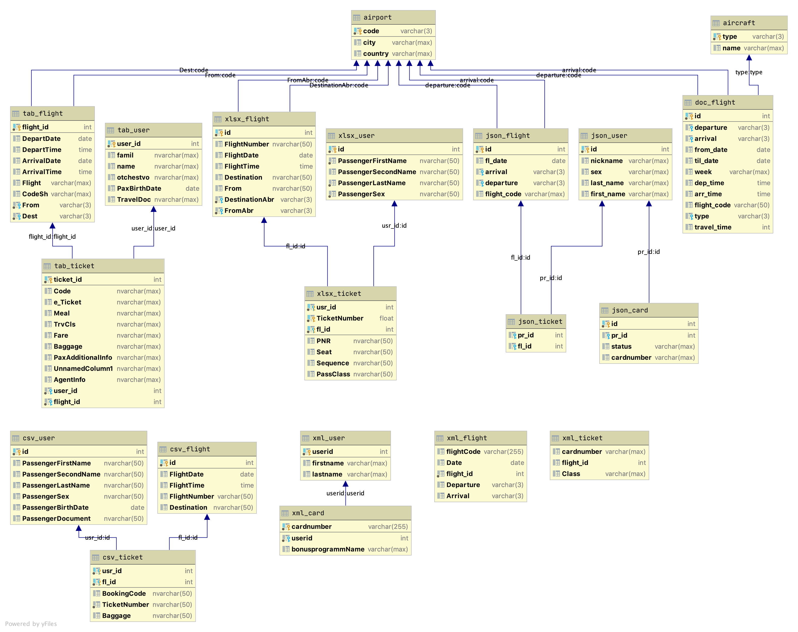

# DataScience project about detecting spies

MEPhI 2020

---

# About

We are the gang of 4 ( [@meyakovenkoj](https://github.com/meyakovenkoj) [@zumvanrin](https://github.com/zumvanrin) [@yurkovkirill](https://github.com/yurkovkirill) [@DyadyaRodya](https://github.com/DyadyaRodya) )
The aim of this project is to find russian spy/spies using data about people movement during a some period according to informaton delivered by Airlines.

# Data

To use this project you should load original data from [source](https://drive.google.com/drive/folders/19bCT5pKF-QnfW05FW0Eb2dUsMrrnbUSD) to path "./orig_data/" (It didn't load to GitHub because of its weight ~1Gb)

Parsed data and another heavy stuff [here](https://yadi.sk/d/MrEP6moVlhLo5g?w=1)

# Tools

To clean your csv file from duplicate lines you can use `csv_cleaner`
Usage:

```bash
python3 csv_cleaner.py <input_file>
```

The out put will be like `<input_file>.clean.csv`

# Database

Firstly we supposed that we could unite all our data. But after quick analyze of data structure, we came to the conclusion that obviously we don't need to do that.
Instead of merging all info about `users` & `tickets` & `flights` we left data from such formats as CSV XML JSON TAB connected in their scope.

We get the database which we will use later.


